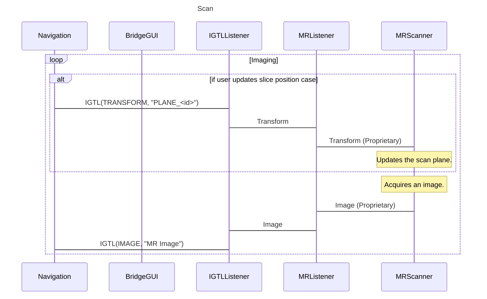

MR IGTL Bridge
==============
Python OpenIGTLink Bridge module for Real-Time Interactive MRI. The goal of this bridge module is to provide a vender-neutral real-time interactive MRI inteface for surgical navigation software, such as [3D Slicer](https://www.slicer.org/). To achieve this goal, the bridge has two network communication interfaces, including open client interface and proprietary scanner interface. 

This repository only provides a platform-independent interface to OpenIGTLink clients. Platform-dependent widget and listner must be provided to connect the bridge to an actual MRI scanner.


Squence Diagram
---------------

```mermaid
sequenceDiagram

title Initialization
participant Navigation

participant BridgeGUI
participant IGTLListener
participant MRListener

participant MRScanner

Navigation -> IGTLListener : IGTL(STRING, "CMD_<timestamp>", Text="START_UP")
activate Navigation
activate IGTLListener
IGTLListener -> MRListener : Command
activate MRListener
MRListener -> MRScanner : Command (Proprietary)
activate MRScanner #DarkGray
MRScanner -> MRListener : Status (Proprietary)
deactivate MRScanner
MRListener -> IGTLListener : Status
deactivate MRListener
IGTLListener -> Navigation : IGTL(STATUS, "MR", Code=01(OK), Message=CURRENT_STATUS)
deactivate IGTLListener
deactivate Navigation

note over Navigation, MRScanner : Transition to "Idle"

```


```mermaid
sequenceDiagram

title Idle
participant Navigation

participant BridgeGUI
participant IGTLListener
participant MRListener

alt If the user subscribes parameters case
  Navigation -> IGTLListener : IGTL(STRING, "CMD_<timestamp>", Text="START_SCAN")
  activate Navigation
  activate IGTLListener
  IGTLListener -> MRListener : Command
  activate MRListener
  MRListener -> MRScanner : Command (Proprietary)
  activate MRScanner #DarkGray
  MRScanner -> MRListener : Status (Proprietary)
  deactivate MRScanner
  MRListener -> IGTLListener : Status
  deactivate MRListener
  IGTLListener -> Navigation : IGTL(STATUS, "MR", Code=01(OK), Message=CURRENT_STATUS)
  deactivate IGTLListener
  deactivate Navigation
  note over Navigation, MRScanner : Transition to "Scan"
end


```




Installation
------------


Before install the module, make sure to install the Python-wrapped OpenIGTLink library. The code and instruction are available at [the Swig-Python OpenIGTLink repository](https://github.com/tokjun/OpenIGTLink/tree/Swig-Python).

The rest of the package can be installed using `pip`. First, download the source from the git repository using the following command:

~~~~
% git clone https://github.com/ProstateBRP/mrigtlbridge
% cd mrigtlbridge
~~~~

Then run the `pip` command. To install into the system:

~~~~
% pip install . 
~~~~

Alternatively, you may choose to install in the user directory:

~~~~
% pip install . --user
~~~~


Usage
-----

This package comes with simulator software. To run the simulator,

~~~~
% mrigtlbridge_sim
~~~~


